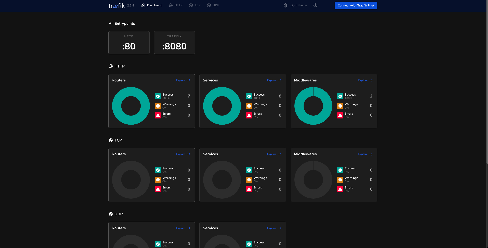
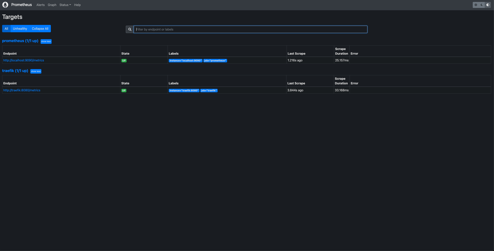
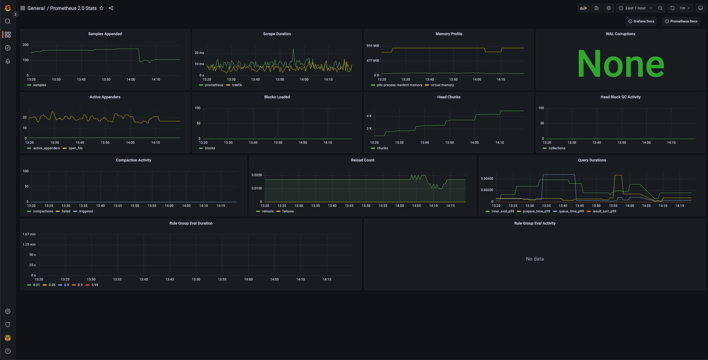
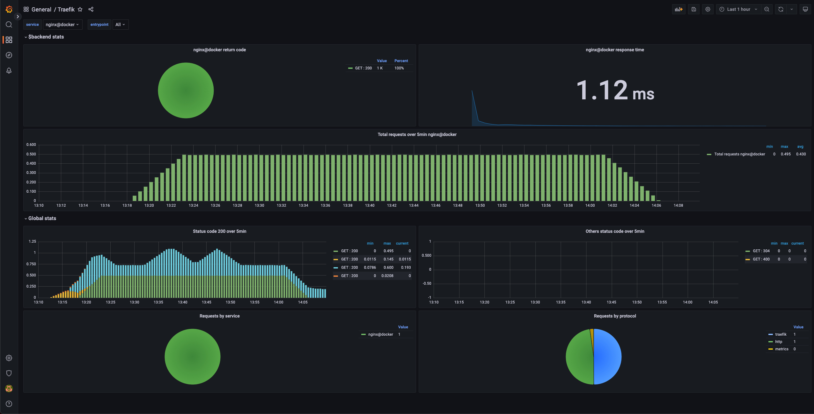

# Traefik Observability

A sample for monitoring traefik with prometheus and grafana

Requirements:
- docker engine
- docker compose v2

## Start containers

```
make up
```

If you don't use docker compose v2, you can run

```
docker-compose up -d
```

## Generate traffic to service

```
watch curl -s localhost
```

## Traefik dashboard

http://localhost:8080



## Prometheus

http://localhost:9090



## Grafana 

http://localhost:3000

username: `admin`
password: `foobar`

Provisioned Dashboards:
- Prometheus 2.0 Stats
- [Traefik](https://grafana.com/grafana/dashboards/4475)





## Stop containers

```
make down
```

If you don't use docker compose v2, you can run

```
docker-compose down
```